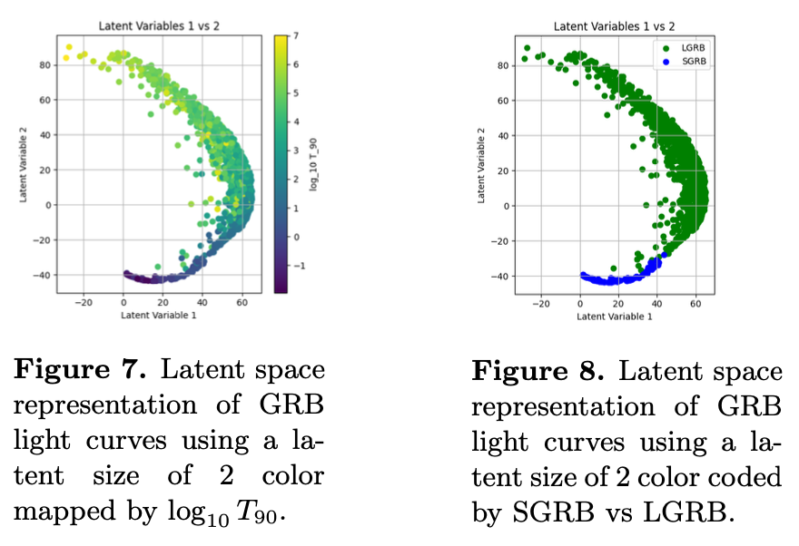

# A Natural Separation of GRBs using Autoencoders on Light Curves

Click [here]((release/final_paper.pdf)) for the paper, click [here](release/poster.pdf) for the poster.

## Abstract

Gamma-ray bursts (GRBs) are traditionally separated by their duration of 90% of significant flux at \( T_{90} = 2s \) into short GRBs (SGRBs) and long GRBs (LGRBs). Short GRBs have been associated to compact merger events which are sources of \( r \)-process nucleosynthesis that is of great academic interest. Compact mergers can also be cross-validated with multi-messenger astronomy through gravitational wave observations. Long GRBs are instead associated with core-collapse Type Ic supernovae. However, recent studies suggest that there is a population of long GRBs that does not have a corresponding visual supernovae. Furthermore, some are confirmed to be compact merger events. This suggests for a new classification of GRBs that is more sophisticated than inspecting \( T_{90} \). Recent work saw machine learning being applied to extract local structures from GRB light curves through t-SNE. However, t-SNE is designed for data visualization of high dimensional data sets and should not be used for clustering. Here we applied a proper dimensionality reduction technique using a type of neural network known as autoencoders. We successfully reduced high-resolution minute-long light curves into 2, 3, and 5 dimensions. A visual separation between SGRBs and LGRBs is observed at \( T_{90} = 2s \), supporting previous literature of a natural separation. However, a clustering technique known as K-means failed to objectively extract this cluster, mainly due to the imbalanced sample with a much higher number of LGRBs than SGRBs, and the Euclidean distance metric and centre-focused approach used with K-means.

## Notes

Initial code is from https://github.com/villrv/grbclassify

`summary.txt` is from https://swift.gsfc.nasa.gov/results/batgrbcat/summary_cflux/summary_general_info/summary_general.txt

## Acknowledgements

A huge thank you to Dr Ashley Villar for teaching the ML techniques and introducing me to the problem of GRB classification.
